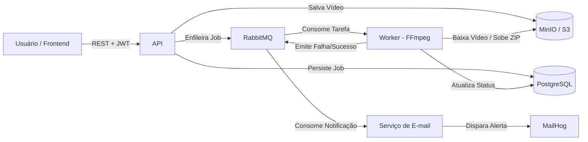

# FIAP X — Sistema de Processamento de Vídeos

Aplicação de processamento de vídeos desenvolvida para o Hackathon (Fase 5). O sistema permite envio assíncrono de vídeos, extração de frames a 1 fps com FFmpeg, geração de arquivo `.zip` para download e notificação por e-mail em caso de falhas, suportando alta concorrência e picos de tráfego sem perda de requisições.

---

## Como Funciona



- **API (`cmd/api`)**: Autenticação (JWT + bcrypt), upload assíncrono imediato (`202 Accepted`), consulta de status e download do zip.
- **Worker (`cmd/worker`)**: Consome da fila com confirmação manual (`ack`), processa o vídeo em diretório temporário, gera o zip e atualiza o banco.
- **RabbitMQ**: Fila durável com Dead-Letter Queue (`DLQ`) para absorver picos de tráfego com zero perda de dados.
- **PostgreSQL & MinIO**: Armazenamento relacional de usuários e jobs, e armazenamento de objetos para os arquivos de mídia.
- **Observabilidade**: Métricas expostas em `/metrics` integradas com Prometheus e Grafana.

---

## Como Rodar Localmente

Pré-requisito: **Docker** e **Docker Compose**.

```bash
# Sobe todo o ambiente (API, Worker, Postgres, RabbitMQ, MinIO, MailHog, Prometheus, Grafana)
docker compose up --build
```

### Links Úteis:
- **Aplicação Web**: [http://localhost:8080](http://localhost:8080)
- **Métricas da API**: [http://localhost:8080/metrics](http://localhost:8080/metrics)
- **Painel RabbitMQ**: [http://localhost:15672](http://localhost:15672) (`guest` / `guest`)
- **Console MinIO (S3)**: [http://localhost:9001](http://localhost:9001) (`minioadmin` / `minioadmin`)
- **Caixa de Entrada MailHog (E-mails)**: [http://localhost:8025](http://localhost:8025)
- **Grafana**: [http://localhost:3000](http://localhost:3000) (`admin` / `admin`)

---

## Testes e Cobertura

Para rodar a suíte de testes com checagem de concorrência e relatório de cobertura:

```bash
make test
make race
make coverage
```

A cobertura atual dos pacotes de domínio, aplicação e adaptadores é de **84.3%** (o arquivo `coverage.html` é gerado na raiz).

---

## Deploy no Kubernetes

Os manifestos estão na pasta `k8s/` e incluem Horizontal Pod Autoscaler (HPA) configurado para escalar os workers de 2 a 10 réplicas conforme a carga de CPU:

```bash
make k8s-apply
```

---

## Endpoints Principais

A especificação completa está em [`api/openapi.yaml`](api/openapi.yaml) e a coleção para testes em [`api/fiapx_postman_collection.json`](api/fiapx_postman_collection.json).

| Método | Rota | Autenticado | Descrição |
|---|---|:---:|---|
| `POST` | `/api/v1/auth/register` | Não | Cadastro de novo usuário |
| `POST` | `/api/v1/auth/login` | Não | Login e emissão de token JWT |
| `POST` | `/api/v1/videos/upload` | Sim | Upload de vídeo (`multipart/form-data`) |
| `GET` | `/api/v1/videos` | Sim | Lista os vídeos do usuário logado |
| `GET` | `/api/v1/videos/:id` | Sim | Detalhes e status do vídeo |
| `GET` | `/api/v1/videos/:id/download` | Sim | Download do `.zip` com os frames |
| `GET` | `/health/live` | Não | Health check da aplicação |
| `GET` | `/metrics` | Não | Métricas do Prometheus |

---

## Roteiro da Apresentação em Vídeo (Máx. 10 Minutos)

1. **00:00 - 02:00 | Contexto e Arquitetura**:
   - Apresentar o problema (processamento síncrono e travamento em picos).
   - Explicar a solução desacoplada: API rápida + Fila durável + Workers escaláveis.
2. **02:00 - 05:00 | Demonstração Prática**:
   - Acessar `http://localhost:8080`, criar conta e fazer login.
   - Enviar múltiplos vídeos simultâneos e mostrar o status mudando de `PENDING` para `PROCESSING` e `COMPLETED`.
   - Baixar o arquivo `.zip` gerado e conferir os frames extraídos.
3. **05:00 - 07:00 | Resiliência e Notificação de Erro**:
   - Enviar um arquivo inválido/corrompido.
   - Mostrar o job marcado como `FAILED` e a notificação de erro recebida no MailHog (`http://localhost:8025`).
4. **07:00 - 09:00 | Qualidade, CI/CD e Escalabilidade**:
   - Executar `make coverage` mostrando os testes e cobertura acima de 80%.
   - Mostrar o workflow do GitHub Actions e o HPA do Kubernetes em `k8s/apps.yaml`.
5. **09:00 - 10:00 | Encerramento**:
   - Conclusão e entrega de todos os requisitos do desafio.
